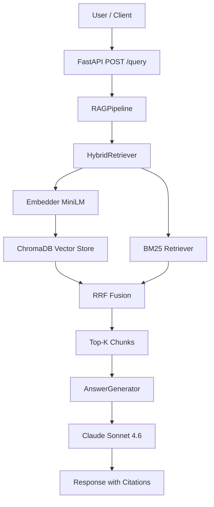

# AWS Docs RAG Assistant

> Production-grade Retrieval-Augmented Generation system that answers questions about AWS services using cited sources from official documentation. Built with Claude Sonnet 4.6, LangChain, ChromaDB, and FastAPI. Containerized for AWS deployment.

[](https://github.com/HenryGlo/aws-docs-rag-assistant/actions)
[](https://www.python.org/downloads/)
[](LICENSE)

---

## 🎯 Problem

AWS documentation spans thousands of pages across hundreds of services. Engineers waste significant time searching for answers to specific configuration, architecture, and best-practices questions across these scattered docs.

This project demonstrates a **production-grade RAG system** that provides accurate, cited answers from AWS documentation in seconds.

---

## 📊 Results

Evaluated on **20 representative AWS questions** using the [RAGAs](https://docs.ragas.io/) framework.

| Metric                              | Score   |
|-------------------------------------|---------|
| **Faithfulness**                    | 0.8953  |
| **Answer Relevancy**                | 0.7397  |
| **Context Precision** (no reference)| 0.6840  |
| **Latency p50**                     | 7.81s   |
| **Latency p95**                     | 13.47s  |
| **Latency avg**                     | 7.77s   |

### Reading the metrics

- **Faithfulness (0.89)**: high adherence to retrieved context — the system rarely hallucinates beyond what the documents support.
- **Answer Relevancy (0.74)**: answers consistently address the questions, with room to improve via better prompt scaffolding.
- **Context Precision (0.68)**: retrieval is solid but not optimal — adding cross-encoder re-ranking is the highest-impact next iteration.
- **Latency**: current p50 reflects unoptimized first version (no model warm-up caching, sequential retrieval). See [Roadmap](#%EF%B8%8F-roadmap).

### Known limitation: self-referential evaluation

This implementation uses **Claude Sonnet 4.6 as both the generator AND the RAGAs judge**. LLM judges tend to favor outputs from the same model family, which can inflate metrics. Industry best practice is cross-family evaluation (e.g., GPT-4o judging Claude-generated answers).

The decision was made to optimize cost for this portfolio project. Adding GPT-4o as a cross-family judge is on the roadmap.

See [EVALUATION.md](EVALUATION.md) for full methodology and dataset description.

---

## 🏗️ Architecture

The system uses a **hybrid retrieval** approach combining:

- **Semantic search** via sentence-transformers embeddings stored in ChromaDB
- **Keyword search** via BM25 (rank-bm25 library)
- **Reciprocal Rank Fusion (RRF)** to merge both retrievers without score normalization
- **Claude Sonnet 4.6** as the generation model with structured citations



---

## ✨ Key Features

- **Hybrid retrieval** combining semantic + BM25 with RRF fusion — outperforms semantic-only on technical acronyms and exact API names
- **Source citations** in every answer with direct links to AWS docs
- **Production patterns**: structured logging (structlog), error handling, type safety (Pydantic), comprehensive tests with mocking
- **Quantitative evaluation** using RAGAs framework with documented limitations
- **CI/CD pipeline** with GitHub Actions: automated tests, lint, Docker build verification
- **Containerized deployment** to AWS App Runner or ECS Fargate (see [DEPLOYMENT.md](DEPLOYMENT.md))

---

## 🛠️ Tech Stack

**AI/ML:** Claude Sonnet 4.6 (Anthropic), sentence-transformers (MiniLM), LangChain, ChromaDB, rank-bm25, RAGAs

**Backend:** Python 3.11, FastAPI, Pydantic v2, structlog, uvicorn, tiktoken

**Infrastructure:** Docker, GitHub Actions, AWS App Runner (planned), AWS Secrets Manager (planned)

**Testing & Quality:** pytest, pytest-cov, ruff

---

## 🚀 Quick Start

```bash
git clone https://github.com/HenryGlo/aws-docs-rag-assistant.git
cd aws-docs-rag-assistant

python3.11 -m venv .venv
source .venv/bin/activate
pip install -e ".[dev,eval]"

cp .env.example .env
# Edit .env: add ANTHROPIC_API_KEY

python -m scripts.ingest
python -m scripts.index

python -m scripts.ask
# Or run as REST API:
uvicorn src.api.main:app --reload
```

---

## 📐 Design Decisions

### Why hybrid retrieval (semantic + BM25)?

Pure semantic search struggles with technical acronyms (VPC, IAM, SQS) and exact service names where embedding-based similarity falls short. BM25 handles those cases robustly through term frequency matching. Combined via Reciprocal Rank Fusion, the system captures both conceptual and keyword-driven queries without requiring score normalization between retrievers — RRF only uses ranks, not raw scores.

### Why ChromaDB?

For this scale, ChromaDB offers zero-infrastructure persistence with strong performance. Its file-based storage avoids the operational overhead of managed services during development. For production at scale (millions of chunks), I would migrate to Pinecone or pgvector with proper sharding strategies.

### Why sentence-transformers locally vs API embeddings?

Local embeddings have zero cost and no external dependencies during indexing. The quality trade-off is acceptable for English technical documentation. For multilingual content or domain-specific deployments, I would benchmark `voyage-3` and `text-embedding-3-large` against retrieval metrics on a labeled dataset.

### Why Claude Sonnet 4.6 as the generator?

Best balance of accuracy, cost, and speed for RAG generation. Strong instruction following with citation formatting. For higher-stakes use cases, Claude Opus 4.7 would be the right upgrade.

### Why self-referential evaluation (and why it's a known limitation)?

This implementation uses Claude as both the generator AND the RAGAs judge. This is a known limitation that can inflate metrics — LLMs tend to favor outputs from the same model family. Industry best practice is cross-family evaluation (e.g., GPT-4o judging Claude-generated outputs).

This decision was made for cost optimization in a portfolio project. Adding GPT-4o as a cross-family judge is on the roadmap.

### Why high latency (p50 = 7.8s)?

The current implementation is unoptimized:
- Embedding model loads on every request (no model warm-up caching)
- Sequential retrieval (semantic + BM25 done in series, could be parallel)
- RAGAs evaluation runs add overhead during testing

Production optimizations identified: model caching, parallel retrieval, request batching, smaller embedder for low-stakes queries. Trade-off chosen: prioritize answer quality and architectural clarity over latency for this portfolio demonstration.

---

## 🧪 Testing

```bash
pytest tests/ -v --cov=src
```

Tests cover critical paths: chunking logic, embedding generation, vector store operations, RRF fusion logic, prompt construction, and generator behavior with mocked API calls (no real API costs in CI).

---

## 📊 Evaluation

```bash
python -m scripts.evaluate
```

Runs the full pipeline on the evaluation dataset and reports RAGAs metrics. See [EVALUATION.md](EVALUATION.md) for the full methodology, dataset description, and known limitations including self-referential bias.

Evaluation cost: ~$2-3 USD per run (Anthropic API for both generation and judging).

---

## ☁️ Deployment

Two recommended paths: AWS App Runner (simplest, for demos) or AWS ECS Fargate (more control, for production). See [DEPLOYMENT.md](DEPLOYMENT.md) for detailed instructions, cost estimates, IAM configuration, and security checklist.

---

## 📚 Lessons Learned

- **Chunk size matters more than expected.** 512 tokens with 50-token overlap was the sweet spot for AWS docs. Larger chunks reduced retrieval precision; smaller chunks fragmented context.
- **Hybrid retrieval is non-negotiable for technical content.** BM25 catches queries semantic search misses entirely, especially service acronyms and specific API names.
- **Self-referential evaluation is a trap.** Using the same model family to generate and judge inflates scores artificially. Documenting this honestly is more valuable than hiding it.
- **RAGAs `max_tokens` matters for Faithfulness.** Default 1024 tokens caused `LLMDidNotFinishException` during claim decomposition; faithfulness returned NaN. Raising to 4096 resolved it.
- **Rate limiting requires explicit RunConfig.** Default RAGAs concurrency exceeds Anthropic free-tier limits, triggering many 429s. `max_workers=4` with extended retries provided stability.
- **Smoke test before full evaluation.** Running on 3 questions first ($0.30) caught a critical bug that would have wasted $3 on a broken full run.
- **Structured logging from day one saves debugging time.** Diagnosing retrieval and evaluation issues became trivial with structlog's key-value output.

---

## 🗺️ Roadmap

- [ ] **Add GPT-4o as cross-family judge** to eliminate self-referential bias and validate metric stability
- [ ] **Optimize latency**: cache embedding model warm-up, parallelize retrieval, target p50 < 3s
- [ ] **Add cross-encoder re-ranking** for top-K refinement — biggest expected win for context precision
- [ ] **Expand evaluation to 50+ questions** for higher statistical confidence
- [ ] **Add Context Recall** with manually annotated ground-truth answers
- [ ] **Multi-turn conversation support** with chat history
- [ ] **Streaming responses** for better UX
- [ ] **Expand corpus** to broader AWS documentation
- [ ] **Cost dashboard** tracking token usage per query
- [ ] **Regression test in CI** that fails if faithfulness drops below threshold

---

## ⚖️ Disclaimer & Attribution

This project is an educational portfolio piece demonstrating RAG architecture for technical documentation Q&A.

- AWS documentation is © Amazon Web Services, Inc. or its affiliates.
- This project is **not affiliated with, endorsed by, or sponsored by AWS**.
- Documentation content is fetched from public AWS documentation pages (docs.aws.amazon.com) for educational and demonstration purposes only.
- This repository **does not redistribute AWS documentation content**. Only the code that fetches it is published here. Users running this code locally fetch content directly from AWS for their own personal, non-commercial use.
- The loader uses respectful rate limiting (1 second between requests) and identifies itself with a transparent User-Agent.
- Sources are always cited in responses with direct links to the original AWS documentation pages.
- For commercial use cases, consult [AWS Site Terms](https://aws.amazon.com/terms/) and obtain appropriate permissions.

---

## 📄 License

MIT License — see [LICENSE](LICENSE) for details.

---

## 👤 Author

**Henry Gomez Lofiego**
Senior ML Engineer | RAG & LLM Specialist | Master's in Data Science (in progress)

- [LinkedIn](https://www.linkedin.com/in/henry-gomez-lofiego/)
- 📧 henrylofiego@gmail.com
- 🌎 Based in Venezuela · Open to remote roles globally
